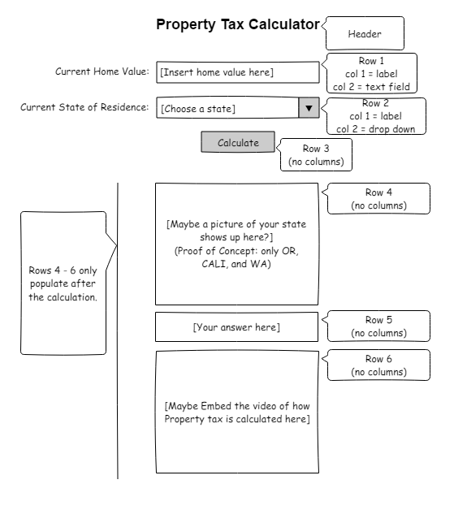

## CS460 Homework 1 - Journal

Homework 2 is designed to famlilizrize the student with HTML forms, javascipt, and jQuerry. We are to create an html form that takes in data, uses javascript to do some calculation on the data, and present the answer back to the user. Also, we are supposed to style the page with CSS and Bootstrap. To plan out the design or our page, we are instructed to create a "wireframe mockup". Further, during the development of our page we are to work in a feature branch of our repo and merge back with the master branch upon completion.

Instructions for HW2 can be found [here](http://www.wou.edu/~morses/classes/cs46x/assignments/HW2.html).

The Website I created can be viewed [here](https://skoliver89.github.io/CS460/HW2/hw2.html).

## Step 1: Create a new feature branch, an empty HTML file, and an empty CSS file

Once I was in the correct directory (CS460/HW2), I created my empty HTML and CSS files; I knew that I would absolutely need these files so added them to the master branch (empty).
```bash
echo "" > hw2.html
echo "" > styles.css
git add *
git commit -m "[message here]"
git push origin master
```
I elected to name what would normally be the index.html file as hw2.html so that I could keep the page in the same directory as my journal entry (index.md) and it would correctly load the journal page. I discovered in the last assignment that pages translates index.md to index.html so naming my HW2 site index.html would cause a conflict.

Next, I created a new feature branch to work in without messing up my master branch called "newFeature".
```bash
git branch newFeature
```
Then, I moved to the newFeature branch so that when I started writing code for my html, css, and js files they would occur on that branch and not master.
```bash
git checkout newFeature
```

To Finish off step 1 I pushed the new branch to my remote repo on git hub.
```bash
git push origin newFeature
```

## Step 2: Brainstorm an idea and create a wireframe for design

In order to keep the page simple as instructed I decided to design a property tax calculator. This is an extremely simple caculation, but I believe it will play well in the role of teaching me how to implement some javaScript into my pages. After some thought on the idea, I decided to add a little complexity by having the user select a state of residence from a drop-down menu. The home value would still be a simple text-field with some added type checking so that the user can't break the equation. The user will hit the "Calculate" button upon entering the data. If there is a black field I will need to present the user with a message informing them of their error. Also, tax rate data for the selected state will be read and selected from a file storing rates for all states in the U.S. The javaScript will the populate an image, if it has one, of the selected state's flag below the button. The answer to the calculation will populate below the flag. Finally, to add a nice finishing touch the page will display a youTube video (embedded) describing how property taxes are calcaculated at the bottom of the page.

To better Visualize my idea, I created a layout wireframe with a program called Pencil. 

*This wireframe is subject to change during the development cycle.

Later, I noticed that the rates I will be using are the median rate so I need to add a note in the page footer to warn the user of this.

NOTE: I found the median rates [here](http://www.tax-rates.org/taxtables/property-tax-by-state)

## Step 3: Create the page

First, I started with the basic blank page template as I did in HW1. I then added the content that the user would see when they first load the page. The user will enter a home value into a text field which is setup to only allow numeric keystrokes (i.e. 1 2 3 4 5 6 7 8 9 0 - +). The - and + symbols are only valid at the begining of a number and I made sure to kick out an error message to the user if a negative value is input into the field. 
The HTML for the text field looks like:
```html
<div class="form-group row">
    <label for="value" class="col-sm-4 col-form-label">
        Current Home Value
    </label>
    <div class="col-sm-5">
        <input type="number" min=0 class="form-control" id="value" placeholder="Home Value">
    </div>
</div>
```
Note: The text field is contained in a div.container with an id of "calcTax"

The user then must select a state from a drop-down; however, if the user skips this step the drop-down defaults for California (CA).
The HTML for the drop-down looks like:
```html
<div class="form-group row">
    <label for="state" class="col-sm-4 col-form-label">
        Current State of Residence
    </label>
<div class="col-sm-5">
    <select id="state" class="form-control">
        <option>CA</option>
        <option>OR</option>
        <option>WA</option>
    </select>
</div>
```
Note: The drop-down is contained inside for the same div.container as the text field.
I will determine the tax rate of the state selected later inside of my JavaScript.

Now that the user has entered all the data that is needed for us to calculate they just click the "Calculate" button and that triggers a listener (jQuery) that calls a function called "clicked".
The HTML for the "Calculate" button looks like:
```html
<div class="form-group row">
    <div class="col-sm-2">
        <button class="btn btn-primary" type="submit">
             Calculate
        </button>
    </div>
</div>
```
Note: This button is in the same div.container as the drop-down and text field.

To put a finishing touch on the pseudo-form that I created I though it might be nice to change it up from the design doc (wireframe) and have the video explaining how property tax is calculated visable under the button from the get go.
Here is the HTML for embedding that video:
```html
<div class="form-group row">
    <iframe  id="video" src="https://www.youtube-nocookie.com/embed/xgGbLotF_QQ" frameborder="0" allowfullscreen></iframe>
</div>
```
I controled the size of the video with the following css:
```css
#video{
    max-width: 450px;
    max-height:  150px;
}
```
Here is the CSS stylings that allow me to center the "form" elements and the button. I also gave the container a nice rounded, soild color background.
```css
#calcTax {
    border-radius: 15px;
    background: grey;
    padding: 20px; 
    color: whitesmoke;
}
div.row {
    justify-content: center;
}
```

I wrote some of the basic content that will display once an answer is asked for into the html. It is hidden in the CSS stylesheet and displayed from the JS script at the correct time.
The container and required rows for the layout for the returned output and the flag are setup in the html document. Since the flag will be hidden until the output is started we don't need to have the container hidden, empty containers do not render.
Here is the HTML for my answer container:
```html
<div class="container" id="answer">
    <div class="row">
        
    </div>
    <div class="row" id="data">          
    </div>
</div>
```
Here is the CSS that I used to control the display status of the flag image (state flag) and setup a similar background for the answer as the "form" only a dark green color instead of grey.
```css
#answer {
    border-radius: 15px;
    background: rgb(0, 114, 0);
    color: whitesmoke;
}
#flag {
    max-height: 100px; 
    max-width: 100px;
    display: none;
}
```
I then finished of the HTML content with a disclaimer that the tax rates used are medians for each state, not exact for your specific region or city/town.
The HTML for the footer looks like:
```html
    <footer>
        <p>Note: Calculations are based on the median rate of the state.</p>
    </footer>
```
The footer element is placed after the closing of the body element.
Here is the CSS I used to pretty up the footer:
```css
footer  p {
    color: rgba(255, 162, 0, 0.61);
    text-align: center;
}
```

Now that the HTML (using bootstrap) and CSS part is complete it is time to get the JavaScript part started! First I had to create a way for my js to listen for the Calculate button to be clicked. I decided to make it easy on myself and use jQuery for this task:
```javascript
$("button").click(function(){
    clicked();
});
```
I used a lot of console logs to show some progress hints in the browser console.
for page load I used: 
```javascript 
console.log("Loaded the page!");
 ```
 I was able to keep this log simple because the js will not load until the end of the body of the html so once this log command runs the page is basically loaded (minus the footer).

The listener for the button calls the "clicked" function. Inside this function I entered some logic to grab the user input values, show the values in the console, a function to figure out the tax rate, calculate the tas amount, show the rate in the console, show the tax amount in the console, and a function to display the relevent info and state flage to the user on the html page.

Here is my "clicked" function:
```javascript
function clicked () {
    console.log("clicked the button!!!");
    //get the values from the html/bootstrap form
    //make sure to make the string of a number in value a number type.
    //note: the bootstrap bit in the form forces the value to be a number.
    var value = Number(document.getElementById("value").value).toFixed(2);
    var state = document.getElementById("state").value;
    //double-check that the value is positive
    if (value > 0) {
        console.log("value = $" + value);
        console.log("state = " + state);
        var rate = Number(readState(state));
        var tax = Number(calcTax(value, rate)).toFixed(2);
        console.log("rate = " + (rate * 100) + "%");
        console.log("taxAmount = " + tax);
        
        //add the output to the html page
        displayInfo(value, rate, tax);  
    }
    else {
        console.log("Home value not valid (0-inf)!");
        alert("Home value not valid (0-inf)!"); //alert the user of their error
    }
}
```
Note: as you can see, I do an if-else statement to check for negative or zero values since these are invalid.

This is what the function "readState" that gets the tax rate for the state and switch to the selected state's flag:
```js
function readState(state){
    var rate = 0.00;
    switch(state) { //get rate by state (only 3 for PoC so switch-case works)
        case "CA":
            rate = 0.74;
            $("#flag").attr("src", "assets/CAflag.png"); //change flag
            break;
        case "OR":
            rate = 0.87;
            $("#flag").attr("src", "assets/ORflag.png"); //change flag
            break;            
        case "WA":
            $("#flag").attr("src", "assets/WAflag.png"); //change flag
            rate = 0.92;
    }
    rate /= 100; //convert the percentage into a usable number.
    return rate;
}
```
Note: For this proof of concept I decided to only include three states (i.e. CA, OR, and WA) so a switch-case was enoiugh to efficiently find the correct tax rate. However, if I was to include more or all of the states I would use some server-side process to pick the rate out of a file or database. Server-side processing is beyound the scope of this assignment so I kept it simple.

The "calcTax" function simply does the, admittedly easy, expression to find your amount of tax and return the number value.
```js
function calcTax(value, rate){
    var tax = value * rate;
    return tax;
}
```

The final function I needed was the one that alters the HTML page to show the results to the user.
I used a mixture of pure js and some jQuery. First, is used jQuery to alter the flag's css settings to change it's display from none to block. I then got the row where my list of data would populate with its id, data. I then proceded to add in the necessary HTML elements for a descriptive list using a built in function called "innerHTML". This function allows me to add some HTML inside of an element. The += operand allows me to append to the inside of the element.
```js
function displayInfo(value, rate, tax){ 
    $("#flag").css("display", "block");
    var item = document.getElementById("data");
    item.innerHTML = '<dl id="dList"></dl>';
    item = document.getElementById("dList");
    item.innerHTML =  "<dt>Home Value($):</dt>";
    item.innerHTML += "<dd>"+value+"</dd>";
    item.innerHTML += "<dt>Tax Rate(%):</dt>";
    item.innerHTML += "<dd>"+(rate*100)+"</dd>";
    item.innerHTML += "<dt>Tax Amount($):</dt>";
    item.innerHTML += "<dd>"+tax+"</dd>";
}
```

With the completion of the HTML, CSS, and js files the page is complete. I tested it out and it worked well. The layout is simple, but functional.

REMINDER - To simplify for a proof of concept this version of the page will only work for the states: Washington, Oregon, and California.

## Step 4: Merge to master


[back to portfolio](https://skoliver89.github.io/)