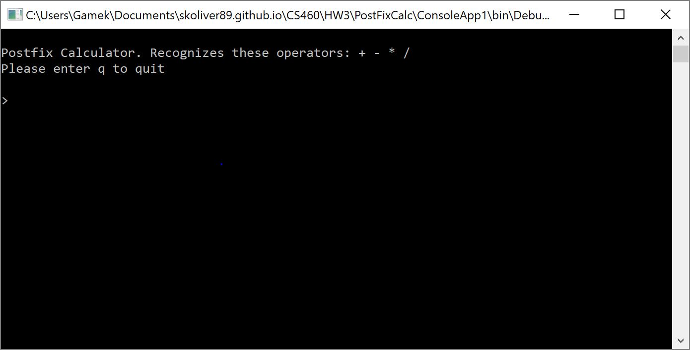
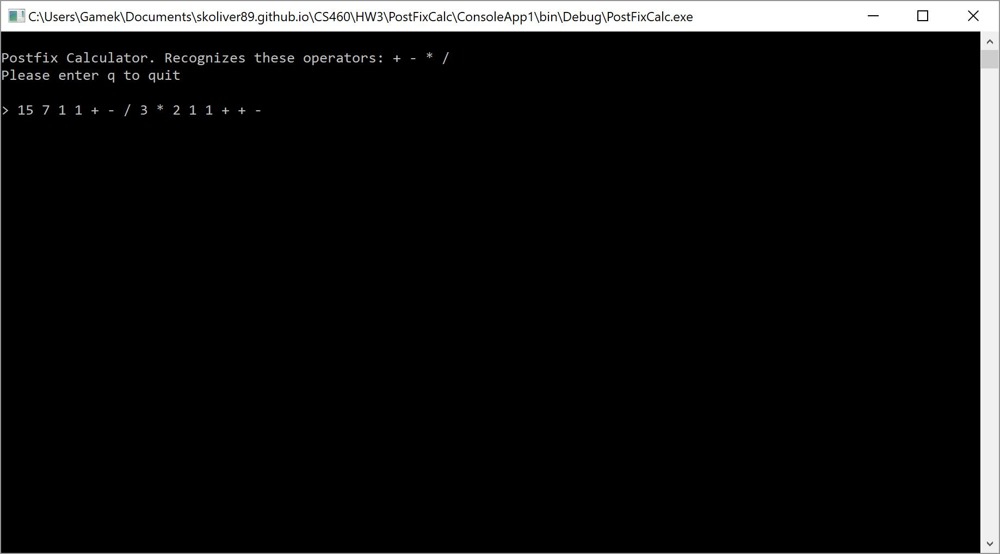
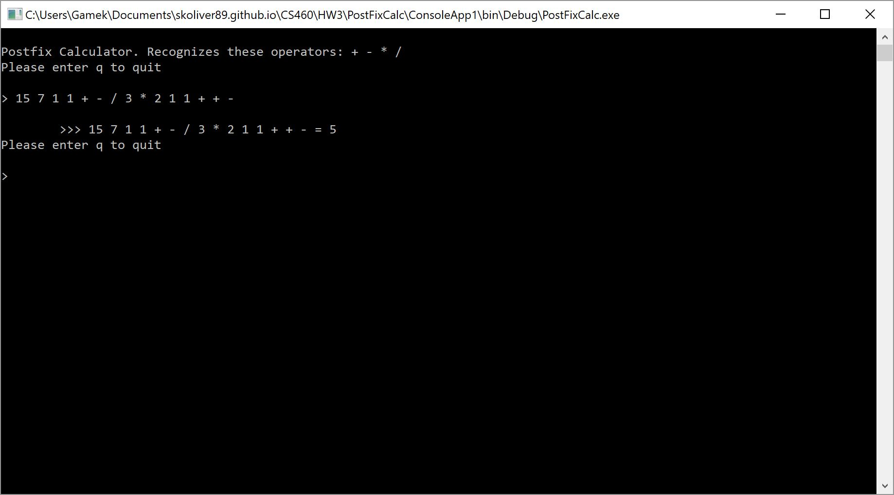
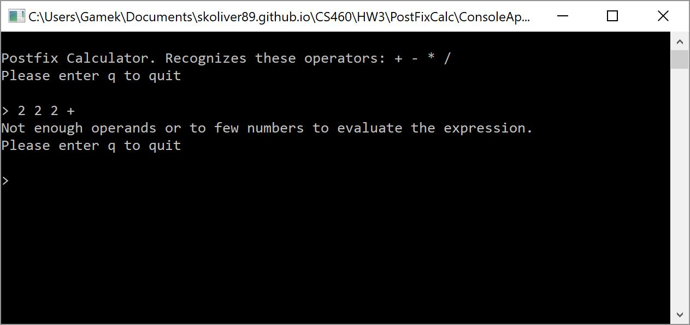
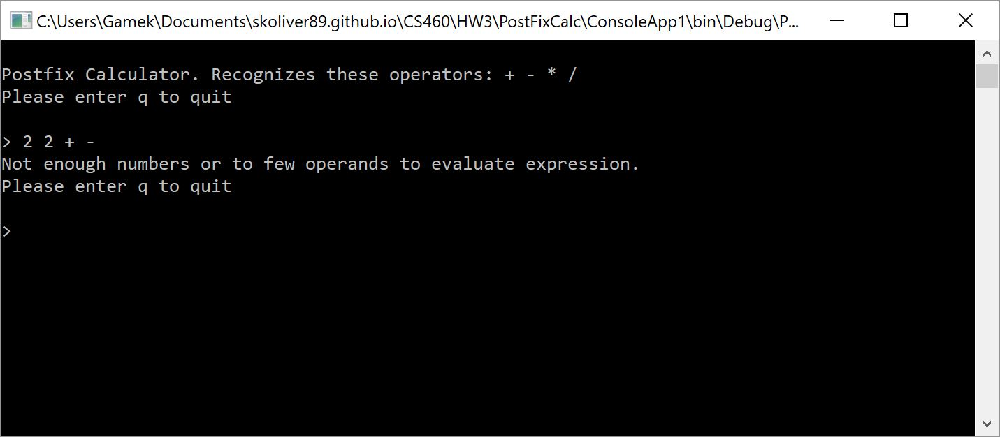
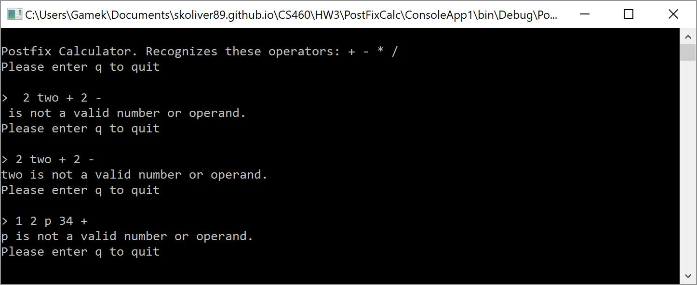

## CS460 Homework 3 - Journal

The primary of objectives of this assignment was to familizrize the student with Visual Studio and C#. The assignment also continues to hone the students' Git skills. The version of VS which will be used is the 2017 community edition. The C3 code written will be moderately complex and be written using standard C# conventions.
The overall requirement of this assignment is to effectively translate a postfix claculator program from Java to C#. The C# code must maintain, or exceed, the commenting in the original Java. Students are reminded to use command line git and NOT the git controls in Visual Studio 2017.

Instructions for this assignment can be found [here](http://www.wou.edu/~morses/classes/cs46x/assignments/HW3.html).

There is no web interface for this assigment so a demo of the program will be contained within this journal entry. As always, the source code for this project can be found in the github repository connected to the above button.

## Step 1: Inspect the original Java source code and lab document

Upon inspecting the Java code and documentation I discovered that the Java code is a solution for a post fix calculator. This source code includes an Interface/ADT (Abstract Data Type) file, a generic definiton of linked nodes and a linked stack using object encapsulation. The jusification for the encapsulation instead of generic data types is that java, at that time, did not support generic typing. Considering that I will be translating the application to C# I decided, with the help of a fellow classmate, that I would go ahead and setup the Interface, Node, and Linked Stack using generic data typing rather than object encapsulation. This decision was reached in order to improve efficiency of the overall application and to make the node and stack classes more easily ussable in other projects. Further inspection into the calculator code I discovered pretty robust error detection and handling on top of a command line interface. Aside from a few cosmetic changes I kept the interface and error handling as close to the original as possible.

## Step 2: Translate the Interface

Original Name: StackADT.java <br />
Translated Name: IStack.cs <br />

This fies is the interface for the methods used in the Linked Stack. The full name of the interface is IStackADT\<T\> using the namespace PostFixCalc. This interface defines the Linked Stack's method signatures and contains the xml comments for each of the aforementioned methods. The T attached to the interface name indicates that the Linked Stack uses generic typing.
Here is a code snippet of what IStack looks like:
```c#
//...
namespace PostFixCalc
{
    /// <summary>
    /// C# Interface defining a stack
    /// </summary>
    /// <typeparam name="T"></typeparam>
    interface IStackADT<T>
    {
        /// <summary>
        /// Method to push a genericly typed new item to the stack
        /// </summary>
        /// <param name="newItem">A generic new item to push</param>
        /// <returns>A reference to the new item</returns>
        T push(T newItem);
//...
```
Note: to view the full code see the HW3 directory in the linked repository at the top of the page.

## Step 3: Translate the Node and Linked Stack classes
### A - Node
Original Name: Node.java <br />
Translated Name: Node.cs <br />

The Node source code was fairly easy to translate from Java to C#. The only differences was turing the comments into XML comments, the properites that C# is able to make use of, and that I did not need to write a default (empty) constructor.
Commenting in XML, as seen in the interface source code above, is estremely easy to accomplish in Visual Studio, just hit the "/" key three times and the editor auto-formats the comment block for you.
The following code snipet shows an XML comment for the Node class and its constructor.
```c#
/// <summary>
/// Constructor for a new Node object
/// </summary>
/// <param name="data">The Payload</param>
/// <param name="next">Reference to the next node</param>
public Node(T data, Node<T> next)
{
    this.data = data;
    this.next = next;
}
```
All that is accomplished in this simple constructor is setting the variables of the node.
As previously stated, C# is able to utilize properties. These properties allow for easy "getting" and "setting" of values held in a class. The following code snippet demonstrates how to write a property for the Node's data variable.
```c#
/// <summary>
/// Constructor for a new Node object
/// </summary>
/// <param name="data">The Payload</param>
/// <param name="next">Reference to the next node</param>
public Node(T data, Node<T> next)
{
    this.data = data;
    this.next = next;
}
```
This property is a read/write property, as is the property for the next variable. To make a property read-only simply ommit the set line.

### B - Linked Stack
Original Name: LinkedStack.java <br />
Translated Name: LinkedStack.cs <br />

The Linked Stack was also fairly easy to translate into C#. The only issues that I encountered was handling the behavior in the pop and peek methods for if the stack is empty. The class is pretty basic; it implements the push, pop, peek, isEmpty, and clear methods. The constructor simply initiates the stack as being empty (i.e. the top node is equal to null). The class is of the same namespace as the previous files, PostFixCalc, and implements/extends the IStackADT\<T\> interface.

The push method takes in a value to be stored and creates a new node to carry that value. The new node links itself to the current top node by reference and then makes itself the top node. Finally, the method returns the value that was pushed to the stack.
Here is what the code looks like:
```c#
public T push(T newItem)
{
    Node<T> newNode = new Node<T>(newItem, top);
    top = newNode;

    return newItem;
}
```

The pop method retrieves the data payload of the top node and then removes that node from the stack, making the node bellow it the new top node. The method then returns the value that was popped off of the stack. If pop is used on an empty stack the method will throw an exception with the message, "Stack Empty!"
```c#
public T pop()
{
    T topItem = top.data;
    if (isEmpty())
    {
        throw new Exception("Stack Empty!");
    }
    top = top.next;
    return topItem;
}
```

The peek method is similar to the pop method except it does not remove and replace the top node. It handles an empty stack in the same way as pop.
```c#
public T peek()
{
    if (isEmpty())
    {
        throw new Exception("Stack Empty!");
    }
    return top.data;
}
```
Note: I decided to throw and exception if the stack was empty in pop and peek instead of returning a null like in the original Java since I am using generics in place of the object encapsulation. My reasoning behind this is that with generics I cannot return a null since it is possible to initialize a generic as a numberic type, C# does not support null as a value for numerics, and I would have to use the default value in the place of null. The default of a numberic is the value 0 (zero) which is a vaild value, hence throwing the exception.

The last two methods, isEmpty and clear, are both carbon copies of the Java code. They are extremely simple; isEmpty returns a boolean true if the stack is empty and clear resets the stack to an empty state by setting the value of the top variable to null.
```c#
public bool isEmpty()
{
    return top == null;
}

public void clear()
{
    top = null;
}
```

## Step 4: Translate the Postfix Calcualtor class

Original Name: Calculator.java <br />
Translated Name: Program.cs <br />

The translated postfix calculator is written , again, fairly similar to the java version. However, I did a couple methods for checking the type of characters entered using REGEX rather than waiting for an argument exeption to be thrown. Also, there are some minor differences in libraries between the two languages. Further, instead of wasting resources instantiating an object of itself in the main method, I wrote this class' methods statically. Just like in the java version, my translated calculator creates the stack as a private global variable; however, because I wrote the C# version statically the stack is also static.

The main method is a simple entry point for the application, it prints out some instruction to the user, starts the method chain loop, and stays "Bye" after the user quits.
```c#
using System;
using System.Collections.Generic;
using System.Linq;
using System.Text;
using System.Text.RegularExpressions;
using System.Threading.Tasks;

namespace PostFixCalc
{
    class Program
    {   //Create a new empty stack
        private static LinkedStack<double> myStack = new LinkedStack<double>();

        /// <summary>
        /// The main method for the PostFix Calculator
        /// </summary>
        /// <param name="args">Comand Line Args (unused)</param>
        static void Main(string[] args)
        {
            //Tell the user what is expected
            Console.WriteLine("\nPostfix Calculator. Recognizes these operators: + - * /");
            bool playAgain = true;
            while (playAgain)
            {
                playAgain = DoCalculation();
            }
            Console.WriteLine("Bye.");
        }
//...
```

The DoCalculation method, called by the main method, starts by promting the user to enter 'q' to quit and then wait for a line of input. This is were if the use enters 'q' it will return false and exit the application. if the user does not enter 'q' the application enters a try/catch block were we attempt start processing the input string for calculation. after the EvaluatePostFixInput method finishes the answer is printed out to the console and the method returns true, promted the main method to run the DoCalculation method again. The catch block looks for a null reference exception, which indicates that the user did not enter enough numbers to evaluate the expression. 
```c#
/// <summary>
/// The entry point for starting the postfix calculation
/// </summary>
/// <returns>returns true is the user doesn't enter q to quit</returns>
static bool DoCalculation()
{
    Console.WriteLine("Please enter q to quit\n");
    Console.Write("> "); //Prompt the User

     //Get space deliminated user input and add to an array of strings
    string input = Console.ReadLine();
    string output = "Empty output";
    //See if the user wishes to quit
    if (input.StartsWith("q") || input.StartsWith("Q"))
    {
        return false;
    }
    //Go go gadget calculator!
    try
    {
        output = EvaluatePostFixInput(input);
        //Write the outputline to the console
        Console.WriteLine("\n\t>>> " + input + " = " + output);
    }
    catch (NullReferenceException)
    {
        Console.WriteLine("Not enough numbers or to few operands to evaluate expression.");
    }
    catch (Exception e)
    {
        Console.WriteLine(e.Message);
    }
    return true;
}
```

User input is space delimited; however, in the EvaluatePostFixInput method, where we parse the user input, I made it consider any amount of whitespace as a delimiter in an attempt to work past some typeos. The input is split into an array by a REGEX string. Then, the application moves element by element through the array and determines, with my custom methods, if the element is a number, operator, or neither. If the element is an operator the DoCalculation method is called on the element which returns a double that is then push onto the stack for later consumption. If element is a number then that number is pushed onto the stack. However, if the element is neither a number or an operator an argumrnt exception is thrown with a message to inform the user that the element is invalid. After the entire array is processed, the top element is poped from the stack and a check is run to determine if the stack is now empty. If the stack is empty then the answer from the calculation is correct; however, if the stack is not empty there was either not enough operands or too few numbers to evaluate the expression.
```c#
/// <summary>
/// Entry point for running the postfix calculations on the input
/// </summary>
/// <param name="input">The (user)input string</param>
/// <returns>calculation output as a string</returns>
static string EvaluatePostFixInput(string input)
{
    string output = "";
    //Handle null or empty input strings by throwing an argument exception
    if (input == null || input.Length == 0)
    {
        throw new ArgumentException("Null or the empty string are not valid postfix expressions.");
    }
    //clear the stack prior to doing a new calculation
    myStack.clear();
    //put the input string elements into a temp array on whitespace
    Regex rgx = new Regex(@"\s+");
    string[] arr = rgx.Split(input);
    /* iterate through the array, pushing numbers into the stack
    * until the element is an operator, then to a calculation
    * and push the answer into the stack 
    */
    foreach (string element in arr)
    {
        if (IsOperator(element))
        {
            try
            {
                myStack.push(DoOperation(element));
            }
            catch(DivideByZeroException e)
            {
                throw new DivideByZeroException("Divide by Zero Error!" + e.Source);
            }
        }
        else if (IsNumber(element))
        {
            //push to stack
            myStack.push(Convert.ToDouble(element));
        }
        else
        {
            throw new ArgumentException(element + " is not a valid number or operand.");
        }
    }
    output = myStack.pop().ToString();
    if (myStack.isEmpty())
    {
        return output;
    }
    else
    {
        throw new Exception("Not enough operands or to few numbers to evaluate the expression.");
    }
}
```

The IsNumber and the IsOperator methods determine whether a provided string is a number or if a string is an operator respectively. The methods accomplish this with REGEX pattern matching. The whole string must pass the pattern match exactly once for either of the methods to return true.
```c#
/// <summary>
/// check to see if a string is an operator
/// </summary>
/// <param name="s">a string to check</param>
/// <returns>true if the string is an operator</returns>
static bool IsOperator(string s)
{
    Regex rgx = new Regex(@"^[+*/-]$");
    if (rgx.IsMatch(s)) //test if the element is a math operator (* + - /)
    {
        return true; //is an operator
    }
    return false; //is not and operator
}

/// <summary>
/// check to see if a string is of a vaild number (positive or negative int or double)
/// </summary>
/// <param name="s">String to check</param>
/// <returns>true if the string is of a valid number</returns>
static bool IsNumber(string s)
{
    Regex rgx = new Regex(@"^[-|+]?(?:\d*\.)?\d+$");
    if (rgx.IsMatch(s))
    {
        return true; //is a number
    }
    return false; //is not a number
}
```

The last method, DoOperation, takes an operator string and pops two nodes from the stack in to local variables a and b. It then determines which operator was passed to it with a switch-case block, runs to appropriate equation, and return the answer. Remember, we need to run an AOB stle equation here were b is the top-most node and a is the second node poped.
```c#
/// <summary>
/// Pop and calculate
/// </summary>
/// <param name="op">the operator to run</param>
/// <returns>the value (answer) from the calculation to push back to the stack</returns>
static double DoOperation(string op)
{
    double answer = 0;
    double b = myStack.pop();
    double a = myStack.pop();
    switch (op)
    {
        case "+":
            answer = a + b;
            break;
        case "-":
            answer = a - b;
            break;
        case "*":
            answer = a * b;
            break;
        case "/":
            answer = a / b;
            break;
    }

    return answer;
}
```

## ---DEMO---

Expression: 15 7 1 1 + − ÷ 3 × 2 1 1 + + − <br />
Expected Answer: 5 <br />
source: [Wikipedia: Reverse Polish notation](https://en.wikipedia.org/wiki/Reverse_Polish_notation) <br />

### Initial start up


### A Correctly fomatted postfix expression


### Answer Display, No errors


### An expression with to many numbers/Not enough operators (Error)


### An expression with to many operators/Not enough numbers (Error)


### An expression containing an invalid element (Error)


To quit enter 'q' or 'Q'. There is no image availiable for this step as the commandline window in Visual Studio immediately quits; however, if the window was to stay open it would print out "Bye."

[back to portfolio](https://skoliver89.github.io)