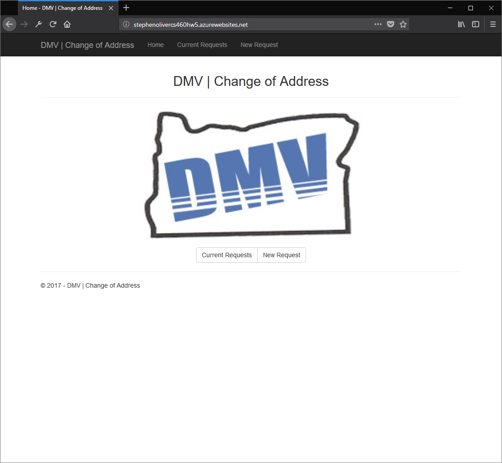

## CS460 Homework 5 - Journal

For this assignment students will create a custom form and a way to view requests for the DMV change of address [form](http://www.oregon.gov/ODOT/Forms/DMV/6438fill.pdf). The student with utilize a simple database (DB) containing a single table to store the data in the App_data folder. Throughout the assignment students will continue to learn more about ASP.NET MVC 5.
Specifically, students will: be able to write a MVC web application that uses a simple one-table local database, be able to write a model class and build a strongly typed view that uses it, be able to write a model class that is backed by an Entity Framework context and a local database, and then create a view to use it in a web page, use Razor to build a table, be able to use NuGet to find and install packages, begin learning Transact-SQL,be able to write a T-SQL script to create a table and populate it with seed data, and learn to use C# language features: properties, lambda functions, object initializers.

Instructions for this assignment can be found [here](http://www.wou.edu/~morses/classes/cs46x/assignments/HW5.html).

Live demo link: [here](http://stephenolivercs460hw5.azurewebsites.net/)

## Demonstration Video 
<a href="https://youtu.be/NIBuvX1QWkE" target="_blank"></a>

## Step 1: Create an empty MVC project &
## A simple home landing page

I created the empty project the same way as in HW4.
However, I added an image and instead of using links to the other pages I used buttons.
Here is how I implemented the buttons with Razor.
```csharp
 @Html.ActionLink("Current Requests", "Index", "Requests", null, new { @class = "btn btn-default" })
```
The responsive bootstrap img that I used on the homepage would not natively center so I had to mess around with a simple CSS style.
```css
#homeLogo.img-responsive {
    margin: 0 auto;
}
```

The HomeController just has the index that returns the view for the landing page.

## Step 2: Create the data model
## (DB Up and Down scripts) 

For my Up-script I created a table on my remote (azure) DB and populated it with 5 test objects (entries). I also specified that RequestID would be the automaticly generated Primary Key.

Table:
```sql
CREATE TABLE dbo.Requests
(
	RequestID			INT IDENTITY (1,1)	NOT NULL,
	IDNumber			INT					NOT NULL,
	DOB					DATE				NOT NULL,
	FullName			NVARCHAR(128)		NOT NULL,
	NewResAddr			NVARCHAR(128)		NOT NULL,
	NewResCityStateZip	NVARCHAR(128)		NOT NULL,
	NewResCounty		NVARCHAR(128)		NOT NULL,
	NewMailAddr			NVARCHAR(128)		NULL,
	NewMailCityStateZip	NVARCHAR(128)		NULL,
	NewMailCounty		NVARCHAR(128)		NULL

	CONSTRAINT [PK_dbo.Requests] PRIMARY KEY CLUSTERED (RequestID ASC)
);
``` 

Objects (Entries):
```sql
INSERT INTO dbo.Requests (IDNumber, DOB, FullName, NewResAddr, NewResCityStateZip, 
	NewResCounty) VALUES
	('3865008', '1968-04-14', 'Smith, John, Jacob', '123 NW Maple DR', 'Oregon City OR 97045', 'Clackamas'),
	('1234567', '1989-07-30', 'Smith, Jane, Rose', '123 NW Maple DR', 'Oregon City OR 97045', 'Clackamas'),
	('1232345', '1997-11-09', 'Doe, Jerry, Killian ', '469 Vista DR APT 101', 'Fantasy Town WA 98001', 'King'),
	('7361245', '2001-02-01', 'Conners, Martha, Pearl', '4357 21st ST', 'Dream City OR 97001', 'Wasco');
	INSERT INTO dbo.Requests (IDNumber, DOB, FullName, NewResAddr, NewResCityStateZip,
	NewResCounty, NewMailAddr, NewMailCityStateZip, NewMailCounty) VALUES
	('1567456', '2000-05-20', 'Smith, Chris, Lee', '123 NW Maple DR', 'Oregon City OR 97045', 'Clackamas',
		'456 College DR', 'Monmouth OR 97361', 'Polk');
GO
```

The Down-script is super simple; all it does is drop the table.
```sql
-- DROP Requests Table
DROP TABLE dbo.Requests;
```

## Step 3: Create the model classes &
## DB context class

For my context class, it contais a base and a property to allow interaction with the DB.
```csharp
public class hw5dbContext : DbContext
{
    public hw5dbContext() : base("name=HW5DBContext")
    { }

    public virtual DbSet<Request> Requests { get; set; }
}
```

For the Model class I wrote the apporpriate properties for the data elements required for the table. Also, I added the string length, required, ahd display _____ to the properties.

Example:
```csharp
namespace ChangeAddressDMV.Models
{
    public class Request
    {
        [Required]
        [Display(Name ="Request #")]
        public int RequestID { get; set; }

        [Required]
        [Display(Name ="ODL/PERMIT/ID/CUSTOMER #")]
        public int IDNumber { get; set; }

        [Required]
        [DataType(DataType.Date)]
        [Display(Name = "DATE OF BIRTH")]
        public DateTime DOB { get; set; }

        //. . .
```

## Step 4: Connect to the DB

To connect to the db I had to add a connection string with the appropriate credentials for the project to properly connect to the remote sql server/db.
```Web.config
  <connectionStrings>
    <!-- add connection strings here -->
    <add name="hw5dbContext" connectionString="Data Source=oliver-cs460.database.windows.net;Initial Catalog=hw5db;Integrated Security=False;User ID=********;Password=********;Connect Timeout=30;Encrypt=True;TrustServerCertificate=False;ApplicationIntent=ReadWrite;MultiSubnetFailover=False" providerName="System.Data.sqlClient"/>
  </connectionStrings>
```

## Step 5: Change of address requests page
## (PRG Controler & Strongly Typed View)

The requests page displays the the current requests in the DB. The Action Method for this page is similar to the launch page, but it returns the view with the DB contents as a list.
```cs
// GET: Requests
// Listing all current requests in the index
public ActionResult Index()
{
    return View(db.Requests.ToList());
}
```
The view is able to interact with the model via the controler with the following line of code.
```html
@model IEnumerable<ChangeAddressDMV.Models.Request>
``` 

The view populates a table of the current requests using Razor Html helpers.
```html
<table class="table table-hover table-responsive">
    <thead>
        <tr>
            <th>@Html.DisplayNameFor(model => model.RequestID)</th>
            <th>@Html.DisplayNameFor(model => model.IDNumber)</th>
<!-- . . . -->
       <tr id="formatHeader">
            <th>#</th>
            <th>#######</th>
<!-- . . . -->
    </thead>
    <tbody>
        @foreach (var item in Model) {
            <tr>
                <td>@Html.DisplayFor(ModelItem => item.RequestID)</td>
                <td>@Html.DisplayFor(ModelItem => item.IDNumber)</td>
<!-- . . . -->
    </tbody>
</table>
```

I controlled the colors and borders of my table with some custom CSS.
```css
table {
    border: 1px solid;
    border-color: lightgray;
}

thead {
    background-color: darkblue;
    
}

thead th {
    color: aliceblue;
    border: 1px inset;
    min-width: 80px;
}
#formatHeader {
    font-size: x-small;
    background-color: grey;
}

#formatHeader th {
    color: lightgrey;
}
```

## Step 6: Change of address form page
## (PRG Controler & Strongly Typed View)

The controler for the New request form page uses the same GET -> REQUEST -> POST method that we used in HW4. The GET action method is simple, it just returns the page view. However, the POST aciton method has some token validation and returns a different view depending on if the state of the model requested is vaild. Also, to recieve the data from the request object a Bind was used.
```cs
 // POST: Requests/New (Create)
[HttpPost]
[ValidateAntiForgeryToken]
public ActionResult New([Bind(Include = "RequestID, IDNumber, DOB, FullName, NewResAddr, " +
            "NewResCityStateZip, NewResCounty, NewMailAddr, NewMailCityStateZip, NewMailCounty")] Request request)
{
    if (ModelState.IsValid)
    {
        db.Requests.Add(request);
        db.SaveChanges();
        return RedirectToAction("Index");
    }
    return View(request);
}
```

The Form for this view is much more complicated than the previous assignment's forms. I used Razor (around the same style as the scaffolded form) to display the labels and post data for the new object. To save space I will only include two of the fields of my form as an example in my code snippet.
```html
<div class="container">
    @using (Html.BeginForm())
    {
        @Html.AntiForgeryToken()

        <div class="form-inline">
            <p><b>NOTE:</b> ALL information is REQUIRED to change your address.</p>
            @Html.ValidationSummary(true, "", new { @class = "text-danger" })
            <div class="form-group" id="medium">
                @Html.LabelFor(model => model.IDNumber, htmlAttributes: new { @class = "control-label col-md-2" })

                @Html.EditorFor(model => model.IDNumber, new { htmlAttributes = new { @class = "form-control" } })
                @Html.ValidationMessageFor(model => model.IDNumber, "", new { @class = "text-danger" })

            </div>
            <div class="form-group" id="small">
                @Html.LabelFor(model => model.DOB, htmlAttributes: new { @class = "control-label col-md-2" })

                @Html.EditorFor(model => model.DOB, new { htmlAttributes = new { @class = "form-control" } })
                @Html.ValidationMessageFor(model => model.DOB, "", new { @class = "text-danger" })
<!-- . . . -->
                 <br />
            <div class="form-group">
                <div class="col-md-offset-2 col-md-10">
                    <br />
                    <input type="submit" value="Submit" class="btn btn-primary" />
                </div>
            </div>
        </div>
    }
</div>
```
I inserted the relevant instructional text from the DMV form as well. To pull this off I added the code into the html form.
Example:
```html
<div class="form-group"> 
    <br />
    <p><b>NEW RESIDENCE ADDRESS</b> (No Post Office Box Number or mail forwarding address)</p>
</div>
```

I did some custom CSS voodoo to make the fields and labels match as closely to the original form as well.
```css
form #long {
    min-width: 76%;
}

form #medium {
    min-width: 45%;
}

form #small {
    min-width: 30%;
}

label {
    min-width: 100%;
}
```
To use this cusom CSS properly I had to remove the pre-loaded CSS from VS that dealt with the input fields.

[back to portfolio](https://skoliver89.github.io)