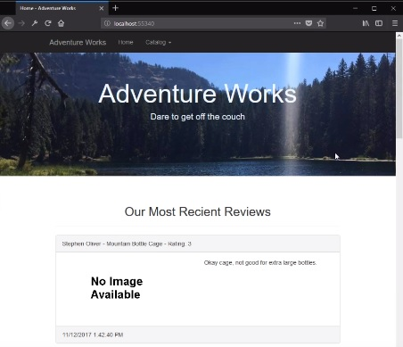

## CS460 Homework 6 - Journal

## Primary Objectives:

1. Be able to write a MVC web application that uses portions of a large, complex pre-existing database
2. Be able to derive C# models from an existing database using Entity Framework and “Code First with an Existing Database” workflow
3. Be able to write LINQ queries using fluent syntax
4. Learn to use C# language features: partial classes
5. Use more Razor language features to build feature-laden views

## Overall Requirements:

* You must use “Code First with an Existing Database” workflow
* Don't add and commit your database file (ignore it please; it's 205 MB)
* If you need to add something to a model class, do it in a new file (still in the model folder) and use a partial class
* Make this a single website, with a landing page and links as appropriate. * * * Remove unnecessary boilerplate and add in something to make it look like a prototype of a real system
* You should prefer strongly-typed views over untyped viewbag-only views
* Use only fluent LINQ syntax (dot notation) and not query syntax (the sql-like version)

## Demonstration Video 
I Could not get the project to publish correctly in the time I allotted myself for this project. Thus, the following video provides a guided tour/demonstration of the finished project. Note, This app was made in a matter of days, expect protype level features and visual quality.<br />
<a href="https://www.youtube.com/watch?v=P_OyhV2Y49Q" target="_blank"></a>

## Step 1: Recover the existing database, Adventure Works 2014
First, I went and got the AdventureWorks2014.bak file from the link indicated by the HW directions. The next step was to launch Microsoft SQL Server Management Studio 2017 and connect to my local MSSQL DB. There, I entered the name of the local server and left the authentication as the default setting handled by my Windows sign-in. Once the data was connected to the management studio I rick-clicked on the databases folder in the server and selected restore database. Next I had to selct the .bak file, it is used as a "disk" so I had to select the appropriate input field, browse for the file and hit run. The AdventureWorks2014 DB is now restored from the .bak file to my local SQL server for use by my application.

## Step 2: Utilize Entity Framework to auto-generate data models, database context, and connection string
I discovered that the installation of Entity Framework is project depended since I remade my project once. It is important to remember that for each project you should go make sure that the tool is installed for that project. I got the EF tool from the NuGet tool manager. After the installation completed, I right-clicked the models folder. Next, I selected "Add" and then "New Item"; a new window now pops-up to select the new item to create. In the new window, select Data, ADO.NET Entity Data Model and name the EDM; This is the name that the context class will have too so I named it like so: [dbname]Context. Click Okay and then select Code First From Database to work from an exiting DB using the code first approach. Make sure "save connection as ..." is checked and select MS SQL Server. Enter the server-name, select the database to use and click Test Connection. If the connection test is successful select the tables that the project will use and, finally, click the finish button. The project will now have the required models, context, and data string to start creating the application. NOTE: Do NOT make changes directly to the auto-generated files; if the database changes/is refreshed these files will be overwritten!

## Step 3: Feature 1: Allow customers to browse products sold buy Adventure Works
For this feature I decided to have the shared _layout.cshtml's  Navbar drop-down handle selecting a product category. The user will then be brought to a new page, handled by a unique action method to that category, where they can select a sub-category of products to view. The action methods for the categories are handled by a seperate controller called "Catalog"; however, if a user attempts to navigate to the "/Catalog" page it will direct them to a view which has links to the product category pages with the sub-catagories listed under them. This is a Bad-User page so it is not pretty, but it serves its function. This Bad-User page is the Catalog controller's index so no special routing was necessary.
The selection of a sub-category is perform with a form submit button click which POSTs the sub-category name to the controler. The controller then provides an IEnumerable<> to the view containing the necessary information for the category page to display a list of products under the sub-category.

I connect My controller to the db Models like so:
```cs
using AdventureWorks.Models;
//...
AdventureWorks2014Context db = new AdventureWorks2014Context();
```

I passed the sub-categories to label the secondary-navbar with via a list of strings that I placed in the ViewBag. This was a simple way to allow me to maintain the buttons in the POST action method while passing a different model to the view.
```cs
List<string> subCats = db.ProductSubcategories.Where(n => n.ProductCategory.Name == "Accessories").Select(sn => sn.Name).ToList();

ViewBag.subCats = subCats;
```

Prior to the POST method the view only renders a category picture followed by the secondary-navbar to select a sub-category from.
```html
@model IEnumerable<AdventureWorks.Models.Product>
<!-- . . . -->
<div class="container-fluid">
    
    <nav class="navbar navbar-default">
        <div class="container-fluid">
            <div class="navbar-header">
                <button type="button" class="navbar-toggle" data-toggle="collapse" data-target="#accNavbar">
                    <span class="icon-bar"></span>
                    <span class="icon-bar"></span>
                    <span class="icon-bar"></span>
                </button>
                <a class="navbar-brand" href="/Catalog/Accessories">Accessories</a>
            </div>
            <div class="collapse navbar-collapse" id="accNavbar">
                <ul class="nav navbar-nav">
                    @foreach (string cat in @ViewBag.subCats)
                    {
                        <li>
                            <form method="post">
                                <button class="btn btn-default navbar-btn" name="subCat" value="@cat">@cat</button>
                            </form>
                        </li>

                    }
                </ul>

            </div>
        </div>
    </nav>
</div>
```
The Foreach loop iterates through the list of subcategories and populates the nav-bar with some awesome buttons.

I collected the products related to the selected subcategory by pulling the sub-category name from the clicked button's name/value pair. 
```cs
// POST: Catalog/Accessories
[HttpPost]
public ActionResult Accessories(string subCat) { /*...*/ }
```

Then I am able to perform a Linq query and store the products in a variable.
```cs
var products = db.Products.Where(s => s.ProductSubcategory.Name == subCat
                                                    && s.FinishedGoodsFlag == true
                                                    && s.DiscontinuedDate == null
                                                    && s.SellEndDate == null);
```

I then check to see if the products variable holds more than zero products; if it does then the user is redirected to the POST view of the category and items are listed to click on for further details. If there are no products, zero, in the variable then the user is redirected back to the GET view of the category where they can select another sub-category.

The view checks to see if the page loaded used post; if it did the product listing is generated.
```html
@if (IsPost)
{
    <div class="container-fluid">
        <div class="page-header text-center">
            <h4>@Model.FirstOrDefault().ProductSubcategory.Name</h4>
        </div>
        <div class="row">
            <div class="col-sm-2"></div>
            <div class="col-sm-10">
                <ul class="list-group">
                    @foreach (var p in Model)
                    {
                        <li class="list-group-item"><a href="/Catalog/Product?id=@p.ProductID">@p.Name (@p.ProductNumber)</a> : $@p.ListPrice</li>
                    }
                </ul>
            </div>
            <div class="col-sm-2"></div>
        </div>
    </div>
}
```

Once the product listing is generated a user may click on the product name to navigate to a product details page. To make it simpler to navigate between the product details page and create product review GET page I handled this page from an action controler called "Product" utilizing QueryStrings. To get to the correct product details page the listing link redirects the user to "/Product?id=[prodID]" where [prodID] is the requested product's ID from the database. If the user attempts to navigate to the "Catalog/Product" page with no parameters (i.e. the product id) they are redirected to the catalog index (i.e. the Bad-User page).

I got the product details with the following lines.
```cs
 int id = Convert.ToInt32(Request.QueryString["id"]);

var product = db.Products.Where(p => p.ProductID == id).FirstOrDefault();
```
To get the product description I decided to try and use a different model so the description is sent to the view via the viewbag.
```cs
//Get the product Model ID for the Description.
int? pmi = product.ProductModelID;
//Get the english description
string desc = "Not Availiable";
if (pmi != null) //if there is a Product Model ID load in the description
{
    desc = db.ProductModelProductDescriptionCultures.Where(p => p.ProductModelID == pmi)
                                                    .FirstOrDefault().ProductDescription
                                                    .Description;
}
ViewBag.desc = desc;
```

I have been returning the product model data to the view like so:
```cs
//...
 return View(product);
```

I display the product details using the same razor-code from HW5's tables, except this time I put them in an unordered list.
```html
div class="container">
    <div class="row">
        <div class="page-header">
            <h2>@Html.DisplayFor(model => model.ProductModel.Name)</h2>
        </div>
    </div>
    <div class="row">
        <div class="col-sm-6">
            <ul class="list-group">
                <li class="list-group-item">
                    <h4 class="list-group-item-heading">SubCategory</h4>
                    @Html.DisplayFor(model => model.ProductSubcategory.Name)
                </li>

                <!-- . . . -->
```
With this the basic configuration of the category views are completed.

## Step 4: Feature 2: Allow customers to create product reviews
To add the feature of users creating views, I decided to have this handled by yet another action method. However, this page utilizes both QueryStrings and the Get-Request-Post methods. The QueryString parameter for product id lets the review page know which product is being reviewed so the user doesn't have to know this information and the review is attached to the correct product. The GRP method handles saving the new review to the database.

First, I crafted the button to let the user navigate to the appropriate create product review page.
```html
<div class="row text-center">
    <h3>Product Reviews</h3>
    <input id="review" type="button" class="btn btn-default" value="Write A Review" 
            onclick="return review_onclick()" />
    <script language="javascript" type="text/javascript">
        function review_onclick() {
            window.location.href = "/Catalog/ProductReview?id="+@Model.ProductID;
            }
    </script>
<!-- . . . -->
```
I decided to house the JavaScript for the button's redirect method inside of the html source since it is so small.

I also added a section under the "Write A Review" button to display all the currently stored reviews.
```html
<!-- . . . -->
    @foreach(var review in Model.ProductReviews)
    {
        <hr />
        <p><b>Rating:</b> @review.Rating</p>
        <p><b>Reviewer:</b> @review.ReviewerName <b>Date:</b> @review.ReviewDate</p>
        <p>@review.Comments</p>
    }
</div>
```

When the button is clicked the "ProductReview" GET action method in the Catalog controller takes over. Again, if a user tries to directly navigate to the ProductReview page with no id parameter they are rerouted to the "Bad-User" Catalog page (Index). The GET action method handles serving the initial review page to the user. I do not pass a model to the page from this method, instead electing to make use of the viewbag some small data elements to the view and let my Razor code create the edit-form for the ProductReviews table entry. This is the same method I used to create new DMV requests in the previous assignment. 

Here is how I pass the small tid-bits needed from the product model to the view (which will later handle the ProductReview model).
```cs
var product = db.Products.Where(p => p.ProductID.ToString() == id).FirstOrDefault();
            ViewBag.ProdID = id;
            ViewBag.prodName = product.Name;
```

My Razor EditorFor Form:
```html
<div class="col-sm-6">
            @using (Html.BeginForm())
            {
                @Html.AntiForgeryToken()
                <div class="form-horizontal">
                    <h3>New Review</h3>
                    @Html.ValidationSummary(true, "", new { @class = "text-danger" })
                    <div class="form-group">
                        @Html.LabelFor(model => model.ReviewerName, htmlAttributes: new { @class = "control-label" })
                        @Html.EditorFor(model => model.ReviewerName, new { htmlAttributes = new { @class = "form-control" } })
                        @Html.ValidationMessageFor(model => model.ReviewerName, "", new { @class = "text-danger" })
                    </div>
                    <!-- . . . -->
                      <div class="form-group">
                            <input type="submit" value="Submit" class="btn btn-primary" />
                    </div>
                </div>
            }
```

Once the user press the Submit button the POST action method switches in. If the user entered in valid data then the following code is executed.
```cs
if (ModelState.IsValid)
{
    //Set the values for the fields to be auto generated from the product/temporal stuff
    review.ProductID = Convert.ToInt32(id);
    review.ReviewDate = DateTime.Now;
    review.ModifiedDate = review.ReviewDate;
    review.Product = db.Products.Where(p => p.ProductID.ToString() == id).FirstOrDefault();

    //Add the new review to the DB and save
    db.ProductReviews.Add(review);
    db.SaveChanges();
    //after save redirect back to the product that was just reviewed
    return Redirect("/Catalog/Product?id="+id);
}
```
As should be obvious, after a valid entry is made the review is saved to the database and the user is redirected back the the product details page belonging to the product that they just reviewed.

If the user enters invalid data nothing is saved to the database and the user is promted to fix errors. The state of the form input fields are maintianed by passing the review model that the user is creating back to the view.
```cs
return View(review);
```
With this final line the functionality for the review creation is completed.

<br />
<br />
## :::BONUS STEPS:::
<br />

## Bonus Step 1: Add product pictures from the database


## Bonus Step 2: Make the launch page do something cool

## Bonus Step 3: Parital class chain/Utilize Metadata class to change the review comment text-field into a text-area.
