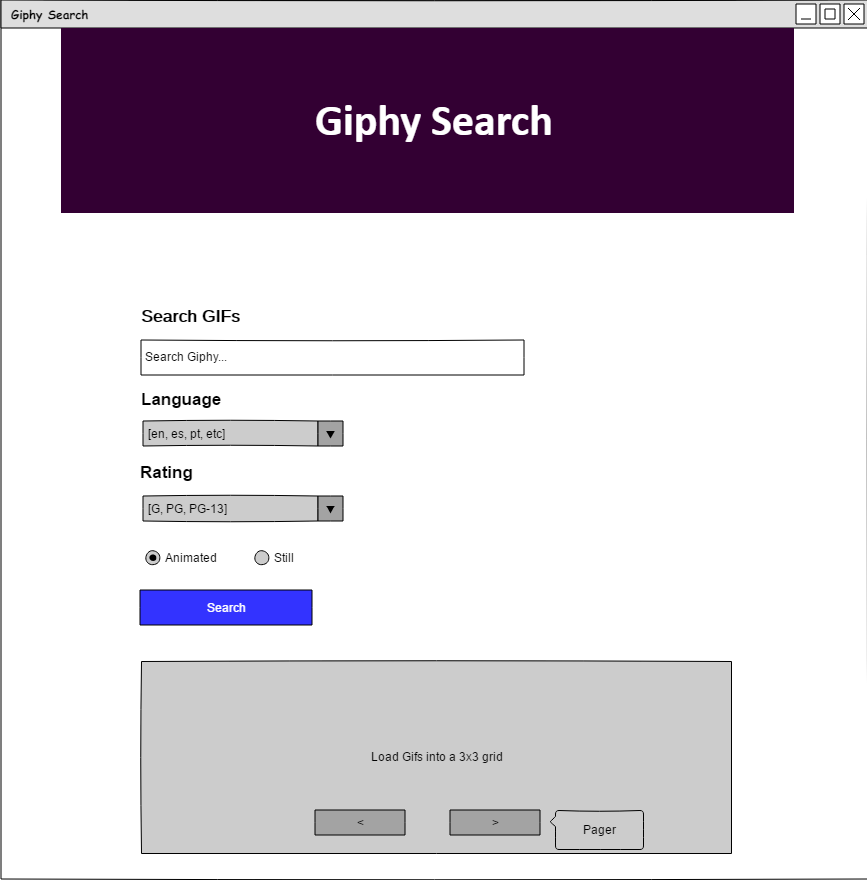

## CS460 Homework 7 - Journal

## Primary Objectives

1. Be able to write a MVC web application that employs AJAX to build responsive views
2. Learn how to use an existing API to acquire data, serverside
3. Demonstrate the use of JSON and AJAX
4. Demonstrate custom routing URLs

## Overall Requirements

* This application should have only one page (main view)
* All functionality is created with Javascript and AJAX calls to action methods that don't return views (ok, you'll have to have one view for the main page itself)
* Use JSON as the data exchange format
* All Javascript must be placed into a separate file (in the Scripts folder) and included via a @section section
* All CSS rules must be placed into a separate file (in the Content folder) and included in the shared layout
* Use a different controller for AJAX calls, that fits with your custom routing (below)
* Write custom routing rule(s) for retrieving data via AJAX with appropriate REST-like URLs
* Use jQuery
* Use CSS to make it look nice
* Use a database for logging of requests

Link to official HW requirements: [here](http://www.wou.edu/~morses/classes/cs46x/assignments/HW7.html)

## Demonstrations
Link to Live Demo: [here](http://stephenolivercs460hw7.azurewebsites.net/)
<br />
Guided video Demo:


## WireFrames
Basic Features:
<br />

 <br />
Basic Features After Search:
<br />
 
<br />
Advanced Features:
<br />

<br />

## Step 1: Put API Key in secret file and use it secretly
First I when to the Giphy Developer site and signed up my app for an API Key. This key is unique to the app and must be kept secret from the source code in my repo and users of my app. To acocmplish the former I created a new folder outside of my local GIT repository to hold files containing secret information like my API key. I created a new config file inside of this folder and created an appSettings section which itself contained the key value pair required for my application to access the API key while keeping it out of my source code and remote/local repositories.

Web.config file:
```config
<appSettings file="../../../../Shadow/appSettingsSecrets.config">
</appSettings>
```

appSettingsSecrects.config file:
```config
<appSettings>
<add key="GiphyAPIKey" value="shhh...it's a secret!">
</appSettings>
```

To access the API key on the server side I implemented the following line inside of a controller.
```cs
string key = System.Web.Configuration.WebConfigurationManager.AppSettings["GiphyAPIKey"]; //retrieve the key from a secret place
```

However, that was only step one; now that I can use the API key outside of my repo I have to make a request to the Giphy server without letting the key leave my server. This is another requirement to keep the key from my cients/users. To accomplish this I first crafted a request URI from the user's input and then utilized the System.Net namespace to make a request to Giphy.
```cs
string q = Request.QueryString["q"]; //the user's search string
string rating = Request.QueryString["rating"]; //desired max msrp rating
string lang = Request.QueryString["lang"]; //language selected, for localization purposes

//Pagination Params - the page variable is from the url route's {page} variable
int limit = 9; //number of images per page, let's not change this for now
int offset = (int)page * 9 - limit; //get the offset for the current page

//Giphy API Reqquest
string url = "https://api.giphy.com/v1/gifs/search?api_key=" + key + "&q=" + q + "&limit=" + limit + "&offset=" + offset + "&rating=" + rating + "&lang=" + lang;

//Get the JSON from Giphy
//inspired by: https://docs.microsoft.com/en-us/dotnet/framework/network-programming/how-to-request-data-using-the-webrequest-class
WebRequest request = WebRequest.Create(url); //send the request

WebResponse response = request.GetResponse(); //get the response
Stream dataStream = response.GetResponseStream(); //start the data stream
string reader = new StreamReader(dataStream).ReadToEnd(); //read in as a string
```
I was able to successfully get the JSON object back from the giphy server; however, I could only get it as a string, but I required a JSON Object. To parse a JSON object from the JSON string I deserialized the string using a built in Mircosoft .NET serializer.
```cs
 //Parse the string into a JSON Object
//inspired by: https://stackoverflow.com/questions/20437279/getting-json-data-from-a-response-stream-and-reading-it-as-a-string
var serializer = new System.Web.Script.Serialization.JavaScriptSerializer(); //prepare the serializer to parse
var data = serializer.DeserializeObject(reader); //parse the string into a JSON object with the serializer's Deserialize method
```
Since the method I used to get the request opened some connections outside of my applcation I made sure to close them once I was finished parsing the data.
```cs
//clean up
dataStream.Close(); //close the stream
response.Close(); //close the response
```

The controller/Method handling my reuqest to the Giphy Sever then returned the JSON object like so:
```cs
return Json(data, JsonRequestBehavior.AllowGet); //return the JSON object, allow GET requests
```

To intiate the API request to the Giphy Server from my JavaScript rendered inside of the html page I utilized an AJAX call back to the appropriate controller using a custom route.

Here is my custom route:
```cs
routes.MapRoute(
    name: "Search",
    url: "gif/searcher/{page}",
    defaults: new { controller = "Giphy", action = "Search", page = UrlParameter.Optional}
);
```

Here is my AJAX call from JavaScript:
```javascript
function search() {
    var q = $("#query").val();
    var rating = $("#rating").val();
    var lang = $("#lang").val();
    var source = "gif/searcher/" + page + "?q=" + q + "&rating=" + rating + "&lang=" + lang;
    console.log(source);
    $.ajax({
        type: "GET",
        dataType: "json",
        url: source,
        success: displayResults,
        error: errorOnAjax 
    });
}
```
NOTE: the page variable is a global variable for this script and is used for pagination; more on this in the Advanced Features step.

## Step 2: Build Basic Features
For basic functionality of my Giphy GIF search app I need to enable users to enter a string which describes the GIFS that they want to see, a button that a user can click to initiate the search request, and an area on the page to populate with the results; however, this only covers the requirements for the UI elements. I must also include logic in my Javascript to listen for the button to be clicked, initiate the call to the contorller mentioned above to perform the request, and the display the results. These requirements must be completed without reloading the page. Finally, I noticed that the text-field would initiate a POST request if the enter key was pressed while the curser was present within it. To combat this default event I added another listener to intercept the enter key, prevent the default behavior, and lauch my own search funtion above. The UI was the easy part; the user input UI elements are a simple text field and a button of type button each with IDs so that my Javascript can listen for a button/Enter Key press and gather the string. In order to populate the page with GIFs without reloading the page I wrote in a hidden section of html that contains placeholder div and image elements (the images have IDs like: "Gif-1, Gif-2, etc). Once the results are gathered the image sources are change by ID and the section is unhidden. Now, A 3x3 of 9 GIFs is displayed from the API request. 

JavaScript Listeners:
```javascript
$("#query").keypress(function (event) {
    //if the key is enter (13)
    if (event.keyCode == 13) {
        //run the search function
        search();
        //prevent generating a querystring
        event.preventDefault(); 
    }
});

$("#search").click(newSearch); //when the search button is click run a new search
```

HTML Request section snippet:
```html
<div id="results" style="display: none">
    <div class="container">
        <div class="row">
            <div class="col-sm-4 gif-col">
                
            </div>
            <div class="col-sm-4 gif-col">
                
            </div>
            <div class="col-sm-4 gif-col">
                
            </div>
        </div>
        <div class="row">
            <div class="col-sm-4 gif-col">
                
<!-- . . . -->
```

JavaScript to display results:
```javascript
function displayResults(data) {
    $("#results").css("display", "grid");
    $(id).attr('src', data.data[i].images.fixed_width.url);
}
```

## Step 3: Build Advanced Features and Styling


## Step 4: Attach DB for Activity Log
To keep track of user traffic we are required to store a log inside of a database (not previously existing) which contains the request querry, request time, user IP address, and user Agent Type. The user data is gathered through the Request class inside of the controller. To get the request time I simple saved the current time to a variable as the request took place. The request query is taken from the user input. I then create a new model instance for the entry and populate it. Lastly, I added and saved the log to the database table.

Create the table:
```sql
CREATE TABLE dbo.RequestLogs
(
	RequestID			INT IDENTITY (1,1)	NOT NULL,
	RequestTime			DATETIME	NOT NULL,
	RequestClientIP		VARCHAR(50),
	RequestClientAgent	VARCHAR(128),
	RequestQuery		VARCHAR(128),
	RequestLang			VARCHAR(10),
	RequestRating		VARCHAR(10)

	CONSTRAINT [PK_dbo.RequestLogs] PRIMARY KEY CLUSTERED (RequestID ASC)
);
```

Gather extra required data:
```cs
DateTime timestamp = DateTime.Now; //Timestamp for user request
string userAgent = Request.UserAgent; //User Agent Type
string userIP = Request.UserHostAddress; //User IP ADDR
```

Create and populate the request log object (model)
```cs
//Create new log entry
var log = db.RequestLogs.Create();
//Add data to the new entry fields
log.RequestTime = timestamp;
log.RequestClientIP = userIP;
log.RequestClientAgent = userAgent;
log.RequestQuery = q;
log.RequestRating = rating;
log.RequestLang = lang;
```

Save the log entry:
```cs
//add the new log to the DB Table and save
db.RequestLogs.Add(log);
db.SaveChanges();
```

[back to portfolio](https://skoliver89.github.io)