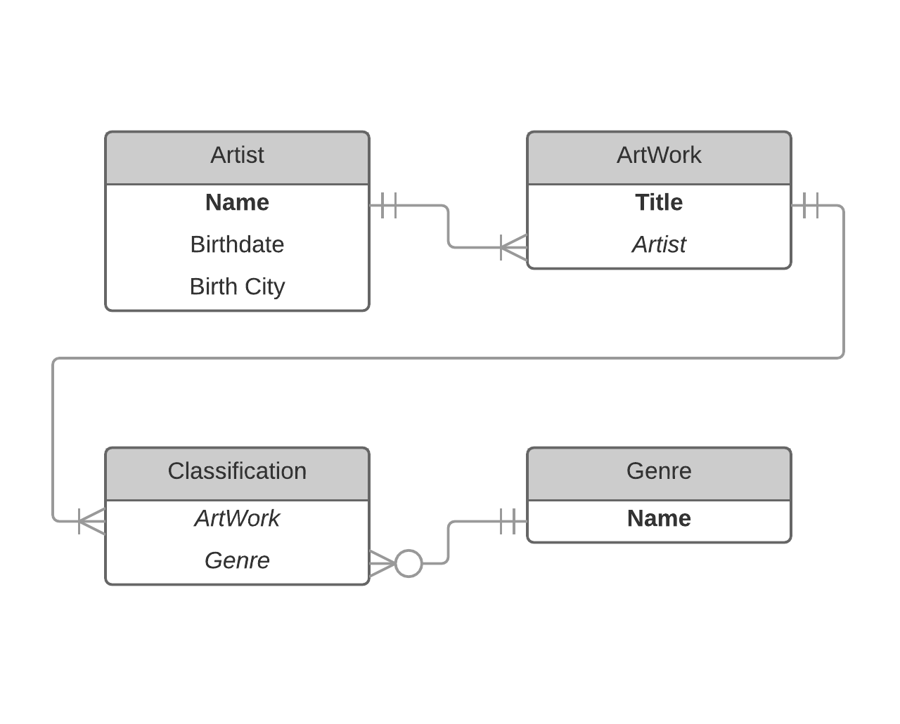

## CS460 Homework 8 - Journal

## Primary Objectives:

1. Be able to write a MVC web application that uses a multi-table, relational database instance that you created
2. Be able to create models with foreign keys and navigation properties
3. Be able to implement CRUD functionality with non-trivial models
4. Learn to write more complex T-SQL scripts to create more complex database tables
5. Practice more LINQ
6. Implement custom attribute checking

## Overall Requirements:

* You must use a “Code First with an Existing Database” workflow
* Use a script to create your tables, populate them with sample data and another to delete them; the script(s) need to be added and committed to your git repository
* All pages must use strongly typed views
* Use only fluent (dot notation) LINQ syntax

Link to official HW requirements: [here](http://www.wou.edu/~morses/classes/cs46x/assignments/HW8.html)

## Demonstrations
Guided video Demo:
<!-- youtube embed goes here -->
<br />
NOTE: The live version of this project will be available in HW9.

## ER Diagram


## Step 1: UP/Down Script
1. UP Script:
    
2. DOWN Script:
For this project's down.sql I had to drop the tables is a specific order since some tables have forgein keys from other tables. The following ordier was required:
```sql
DROP TABLE IF EXISTS dbo.Classifications;
DROP TABLE IF EXISTS dbo.ArtWorks;
DROP TABLE IF EXISTS dbo.Genres;
DROP TABLE IF EXISTS dbo.Artists;
```

## Step 2: Artists/ArtWorks/Classifications Menu


## Step 3: Add attribute checking


## Step 4: Implement a CRUD fore Artists
1. Index/List Page:

2. Create page:

3. Details page:

4. Edit page:

5. Update page:

6. Delete page:

## Step 5: List items of a Genre on mainpage using AJAX


[back to portfolio](https://skoliver89.github.io)