## CS460 Homework 8 - Journal

## Primary Objectives:

1. Be able to write a complex MVC web application and deploy to the cloud
2. Learn how to provision and deploy a database to the cloud

## Overall Requirements:

* Use Azure for both the web application and the database
* Must build the database from script files that are maintained in your project under Git
* Your database password cannot appear in your Git repository

Link to official HW requirements: [here](http://www.wou.edu/~morses/classes/cs46x/assignments/HW9.html)

## Step 1 - Create Azure SQL Server Database
1. Log into Azure Portal and click on "SQL databases."
2. Click "Add" in the top right 
3. Fill out the details and click create, this will take some time.

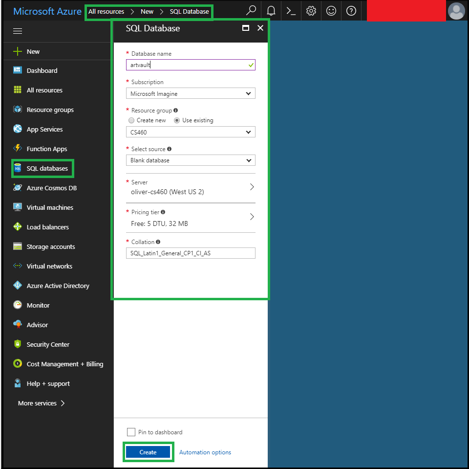

## Step 2 - Create Tables From up.sql In Project
1. Open MSSQL Management Studio 2017
2. Connect to the azure database server. Found at the top of the DB server overview on the Azure Portal under "Server name."
3. Open up.sql from the project App_Data folder. File -> Open File
4. Execute up.sql on the Azure SQL Server DB

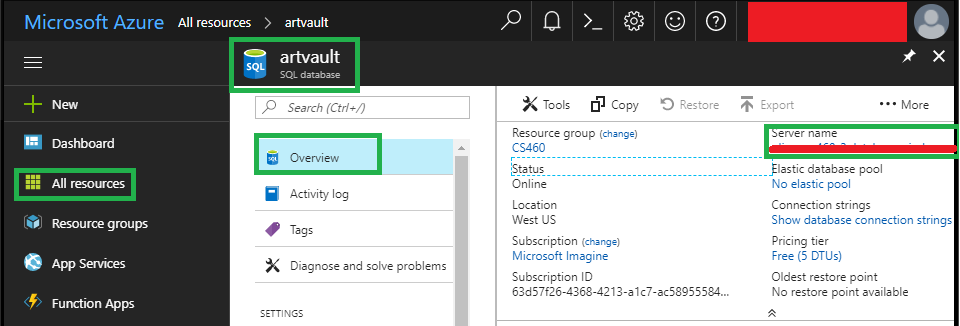
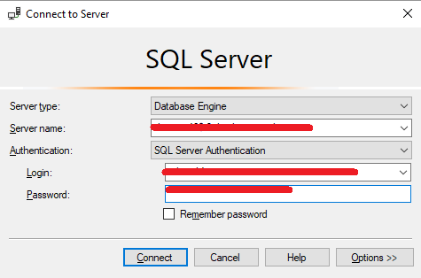
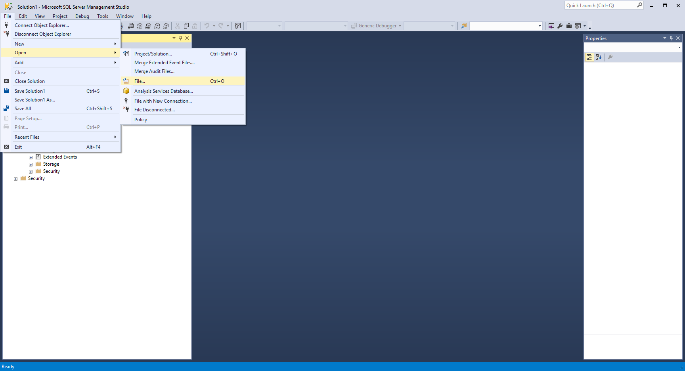
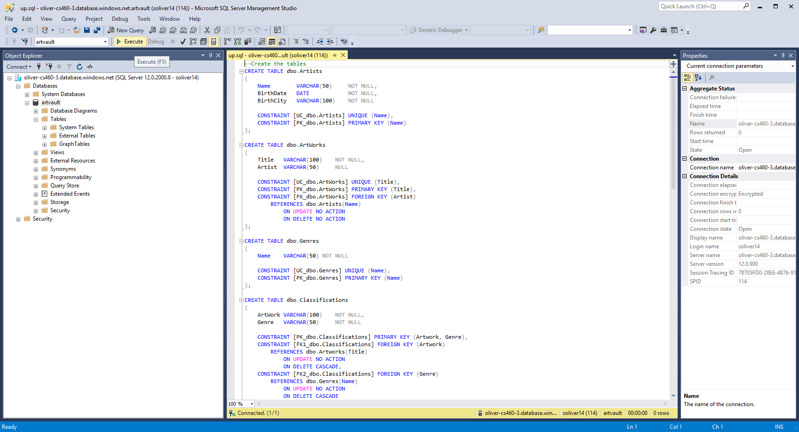
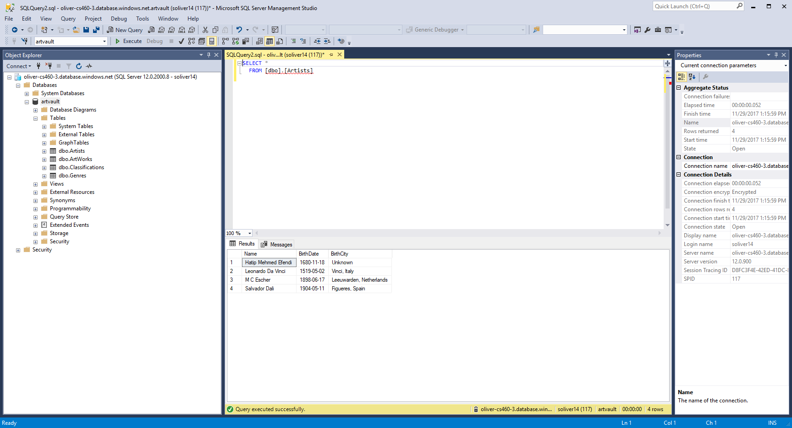
Azure DB ERD:
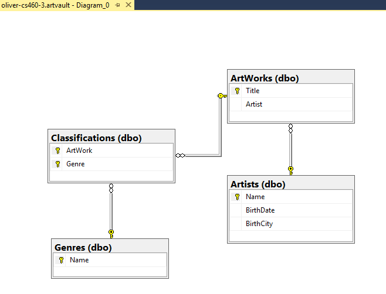

## Step 3 - Create Azure App Service
1. Log in to Azure Portal (if not already)
2. Click "App Services"
3. Click "Add" in the upper-left corner
4. Click "Web App" (or whatever type of app is required)
5. Click "Create"
6. Fill out the creation Form
7. Click "Create" (This may take a moment)

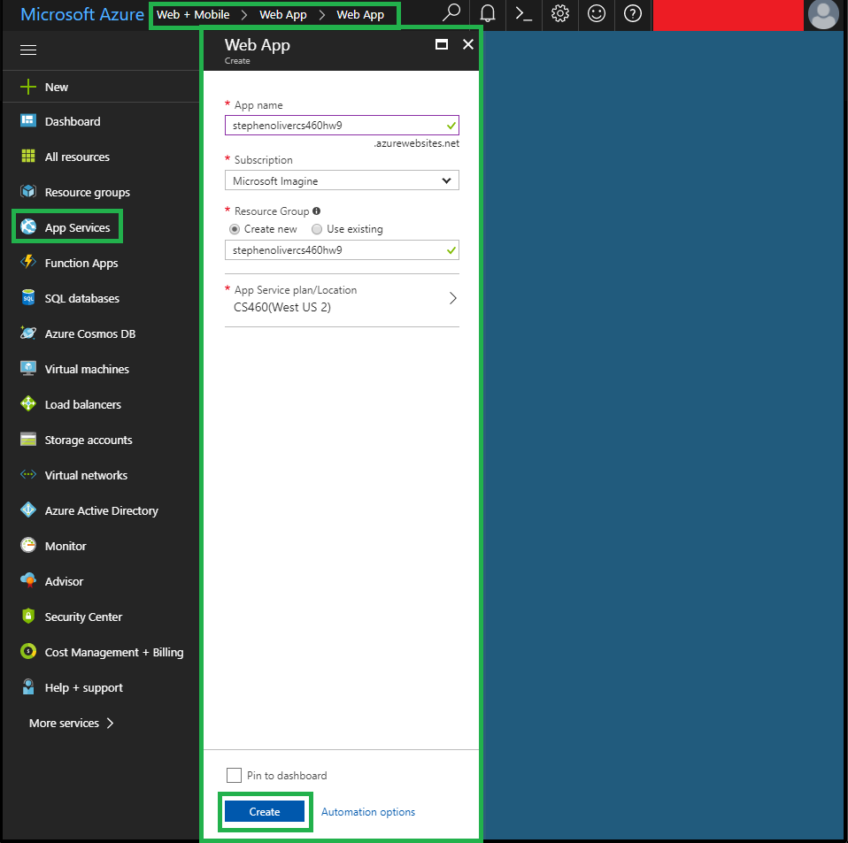

## Step 4 - Publish App

1. Open the Project Solution in Visual Studio 2017
2. Right click the project inside of the solution explorer and select "Publish..."
3. Select "Microsoft Azure App Service"
4. Select the "Select Existing" Radio Button
5. Click "Publish"
6. Select the Account, Subscription Plan, and Resouce Group to search for the App Service we created.
7. Select the App Service from the bottom selection menu
8. Click "OK"

## Step 5 - add the Remote DB Connection String to the App Service
1. Log in to Azure Portal (if not already)
3. Click "SQL databases"
4. Click on the project's Azure SQL DB
5. Click "Connection strings"
6. Copy the connection string to the clip-board
7. Click "App Services"
8. Click on the projects App Service
9. Click "Application Settings" under "SETTINGS" in the menu on the left
10. Scroll down to the "Connection strings" section
11. Enter the name for the connection string into the "Name" field (i.e. "ArtVaultContext")
12. Paste the Connection String from the DB into the "Value" Field
13. Click "Save" (This may take a moment)

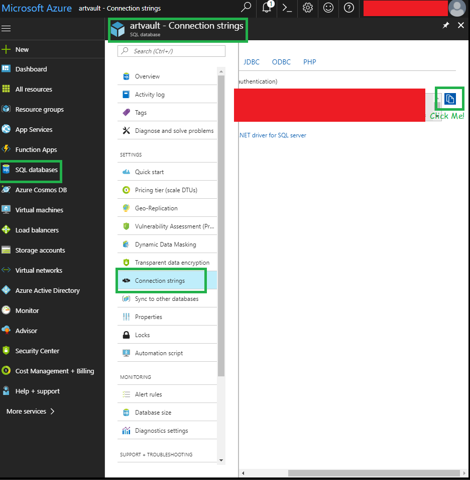
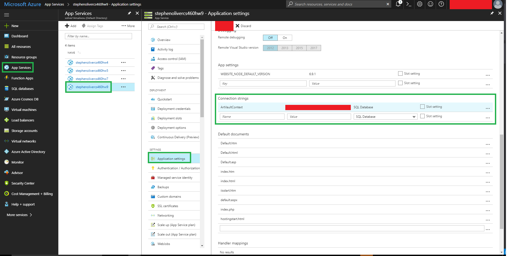
Congrats, You are finished:
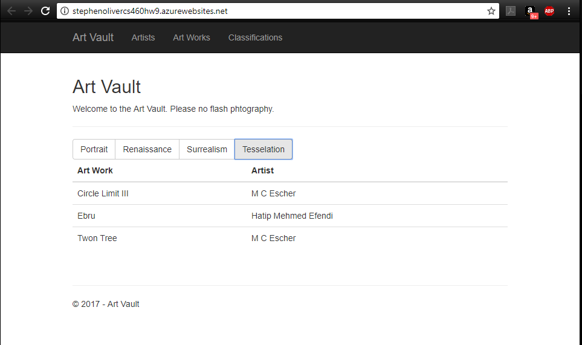

[back to portfolio](https://skoliver89.github.io)
